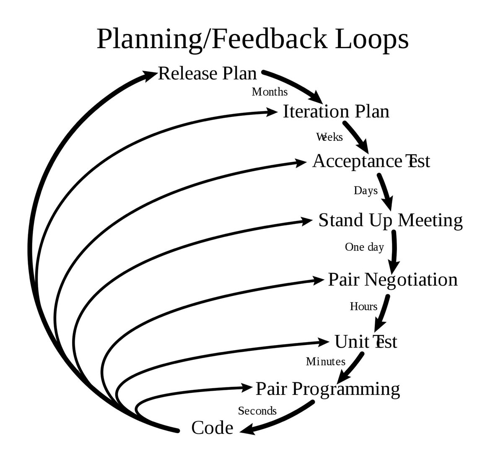

# Introduction + Part I

<!--toc:start-->

- [Introduction + Part I](#introduction-part-i)
  - [Qualities of code](#qualities-of-code)
  - [Complexity](#complexity)
    - [Accidental complexity](#accidental-complexity)
    - [How to detect complexity?](#how-to-detect-complexity)
    - [Mitigating complexity](#mitigating-complexity)
      - [Tactical vs strategic programming](#tactical-vs-strategic-programming)
      - [Extreme programming (XP)](#extreme-programming-xp)
      - [Technical practices](#technical-practices)
  - [Values from XP](#values-from-xp)
  - [Summary](#summary)
  <!--toc:end-->

> The goal of software design is to build products that **serve the needs of the
> customer** and can be **cost-effectively changed by developers**.

Two types of wisdom:

- Sophia (factual wisdom) teaches what you _can_ do (knowledge that we often
  equate to science)
- Phronesis (practical wisdom) teaches what you _should_ do (based on XP, harder
  to teach).

Code is here to serve our client and it should be testable, flexible and
maintainable so it's cost-effective to develop it.

## Qualities of code

1. Serves the needs of the customers - are we meeting the functional and
   non-functional product requirements?
2. Flexibility - adding new features shouldn't add too much new code and it
   should change as little existing code as possible
3. Testability - can we add new features without breaking existing ones?
4. Maintainability - needs to be designed so it can be cost-effectively changed

## Complexity

Two types of complexity

- Essential complexity is the bare minimum. This is what we need to build, but
  not how it's built.
- Accidental complexity is the implementation space (function, loops, classes,
  duplication, dead code, outdated comments,...) - we try to minimize it as much
  as possible.

### Accidental complexity

- Getting the requirements wrong
- Dependencies (tight coupling) - can't test self-sufficient unit in isolation
- Duplication (coupling)
- Dead code (cohesion)
- Poor modularity (cohesion)
- Poor docs (cohesion)
- Obscurity (low cohesion) - how much components belongs together
  - useless information
  - poor packaging
  - incorrect/confusing abstractions
  - unnecessary (early) abstractions
  - missed abstractions
- More developers (F. Brooks - The Mythical Man-Month)
- Lang and API capabilities - more power and options => larger the surface area
  to create Accidental complexity
- Premature optimization => more state - non-essential state is one of the
  leading causes of software complexity (related: Out of the Tar Pit by Ben
  Moseley)

### How to detect complexity?

- Ripple - what appears to be a simple code change actually means changes in
  several other parts
- Cognitive load - too much abstraction and encapsulation
- Poor discoveribility - where things are, what things are, what we can do with
  them
- Poor understandability - we want to add some logic but we have no idea how to
  do it
  - "all non-trivial abstractions eventually leak" (Joel Spolsky)

### Mitigating complexity

#### Tactical vs strategic programming

- Tactical approach - just coding and using whatever works best until it works
  the way we want to (PoC, experiments).
- Strategic approach - 50 % writing code for the customer and 50 % for our
  maintainers

#### Extreme programming (XP)

Methodology created by Kent Beck. It was intended to improve software quality
and responsivness to changing customer requirements.

#### Technical practices

- Feedback

  - pair programming
  - planning game - release planning and iteration planning
  - TDD
  - whole team - customer is a part of it

- Continuous process

  - CI
  - Design improvements/Refactoring
  - Small releases

- Shared understanding

  - Coding standard - coding conventions
  - Collective code ownership
  - Simple design
  - System metaphor (DDD) - use the language from the domain to name features,
    methods, variables...

- Programmer welfare

  - Suistanable pace - devs shouln't work more than 40 hours a week

## Values from XP

**Feedback** - focus on pair programming, TDD (acceptance tests and unit test).

**Simplicity** - we need a repeatable, practical way to develop the simplest
possible thing.

**Communication** - the program intent is best communicated by the code itself.
There's always going to be a single highest layer of abstraction that represents
the code as close to the _essential complexity_ as possible. This will be our
_acceptance tests_ code.

> Programming is the art of telling another human being what one wants the
> computer to do - Donald Knuth

## Summary

- The difference between amateur and the professional: ability to conquer
  complexity
- XP is probably the best development methodology for reducing complexity in
  object-oriented software projects
- Technical practices, TDD and pair programming, help us write better code and
  catch bad designs before they have a chance to solidify themselves in our code
- We will follow these as _rules_ because we don't have exp with them yet
- Over time, treated as rules - practice the techniques and you'll develop your
  own set of principles. Then, you decide for yourself if and when to use them
  or not.
