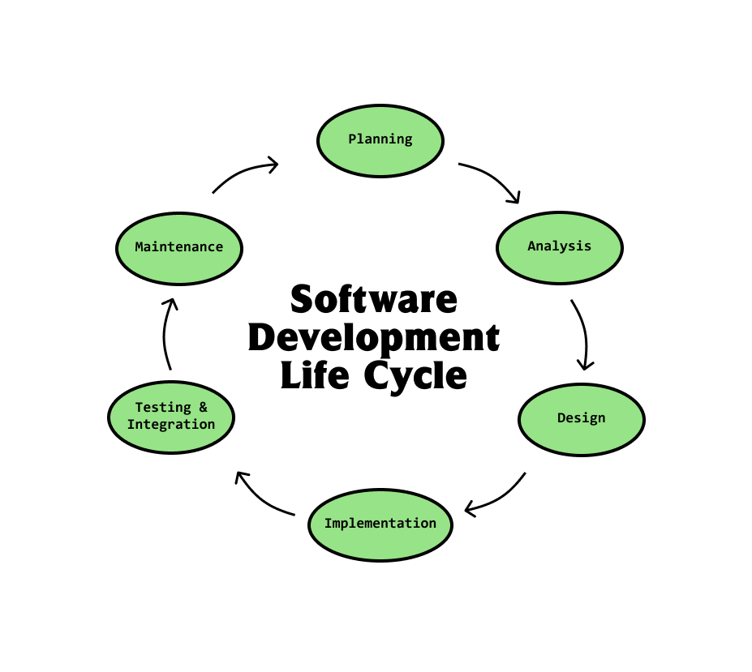
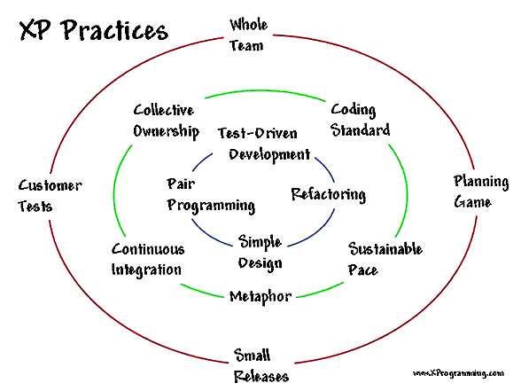
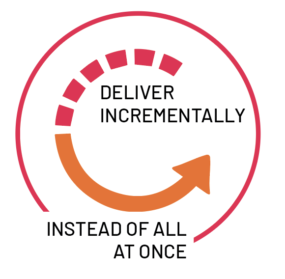
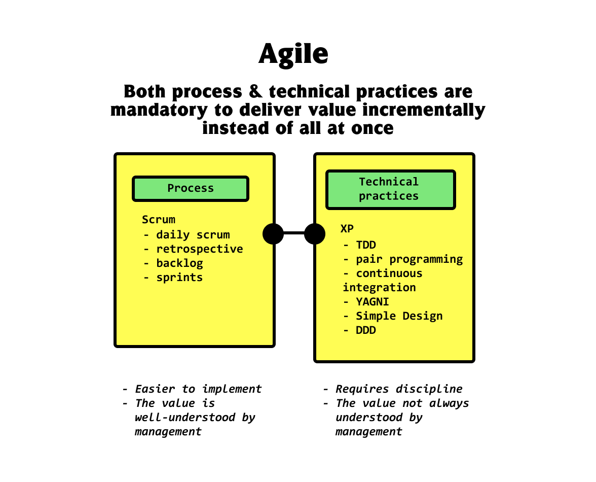

# Software Craftsmanship

> Software craftsmanship is professionalism in software development.

Today, what we _can do_ is **adopt a craftsmanship mentality**.

## Craftsmanship principles

- Care about what you do.
- Use Agile technical best practices.
- Always be improving yourself.
- Know your industry.
- Learn the domain.
- Ruthless simplicity.
- Practice.
- Apply the Boy Scout's Rule.
- Refactor, guarded by tests.
- Be brave.
- Learn and apply XP.
- Delight customers, helping them achieve whatever they want.
- Learn from others.
- Mentor less experienced developers.
- Share what you know.
- Socialize with others.
- Take responsibility for success/failures.
- Help them see the value of technical practices.
- Don't overwork yourself.
- Provide value, even when it's not coding.

---

## A brief history of software development

The big challenges up until this point:

1. 50s - programming picking up speed
   - realizing how software is _planned, designed, built and maintained_ => The
     **Software development Life Cycle** (SDLC)
     
   - 1956 - Waterfall model: an iterative approach to building software
   - in later years: **Software Development Methodologies** like XP, FDD,
     Scrum,... - they act as frameworks to move through each phase in the SDLC -
     give you rules to follow
2. 60s-80s - the software crisis
   - discovered most of the **major problems** in software engineering: they are
     based around _productivity_ and _quality_
     - IBM System/360 - developed entire decade and 1000 devs participated ->
       productivity failure
     - Therac 25 - buggy radiation therapy machine that malfunctioned and killed
       4 people and left 2 patients with lifelong injuries -> quality failures
3. 1995-2001 - dot-com bubble, and XP

   - companies realized the potential fo the internet
   - Object-oriented programming became the most popular programming paradigm,
     surpassing procedural programming
   - Kent Beck formalized Extreme Programming (XP) - born out of the dot-com era
     of quickly changing requirements

     

4. 2001-today - Agile

   - 17 influential developers agreed on the Agile manifesto

     Kent Beck, Mike Beedle, Arie van Bennekum, Alistair Cockburn, Ward
     Cunningham, Martin Fowler, James Grenning, Jim Highsmith, Andrew Hunt, Ron
     Jeffries, Jon Kern, Brian Marick, Robert C. Martin, Steve Mellor, Ken
     Schwaber, Jeff Sutherland, and Dave Thomas

     

   ***

   - **Agile manifesto**

     - **Individuals and interactions** over processes and tools
     - **Working software** over comprehensive documentation
     - **Customer collaboration** over contract negotiation
     - **Responding to change** over following a plan

   ***

   - The (Misled) Era of Agile

     - agile coaches helped companies perform an Agile transformation
     - developers became generalists
     - didn't work because two things are required: **process** and **technical
       practices**

       

5. 2006-today - Software Craftsmanship

   - related book: The Pragmatic Programmer: From Journeymen to Master
   - Uncle Bob proposed a fifth value for the Agile Manifesto: **craftmanship
     over execution**

   ***

   - **Software Craftsmanship Manifesto**

     > As aspiring Software Crasftsmen we are raising the bar of professional
     > software development by practicing it and helping others learn the craft.
     > Through this work we have come to value the following:

     - **Not only working software**, but also well-crafted software
     - **Not only responding to change**, but also steadily adding value
     - **Not only individuals and interactions**, but also a community of
       professionals
     - **Not only customer collaboration**, but also productive partnerships

   ***
