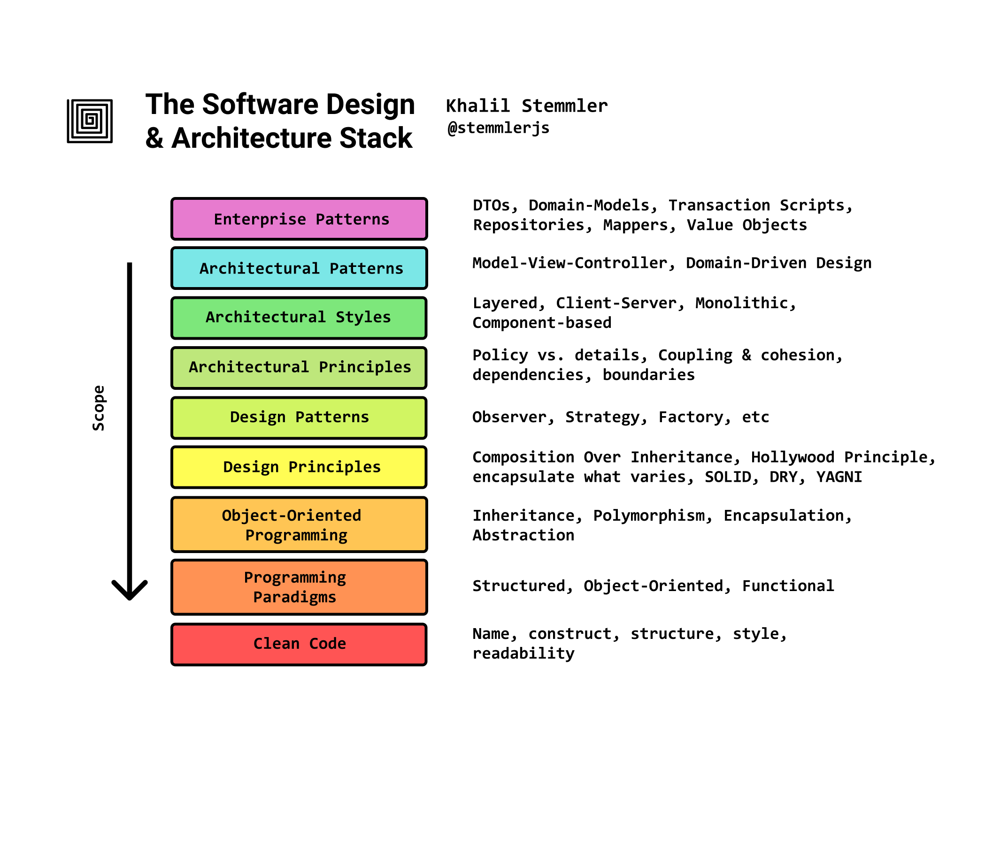
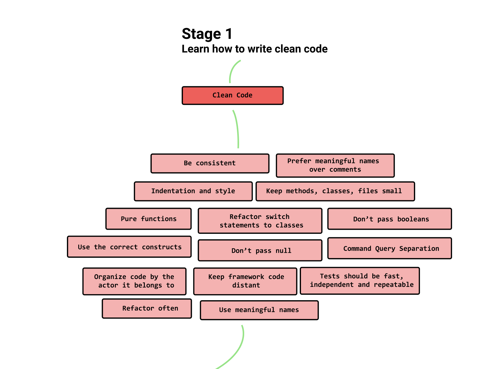
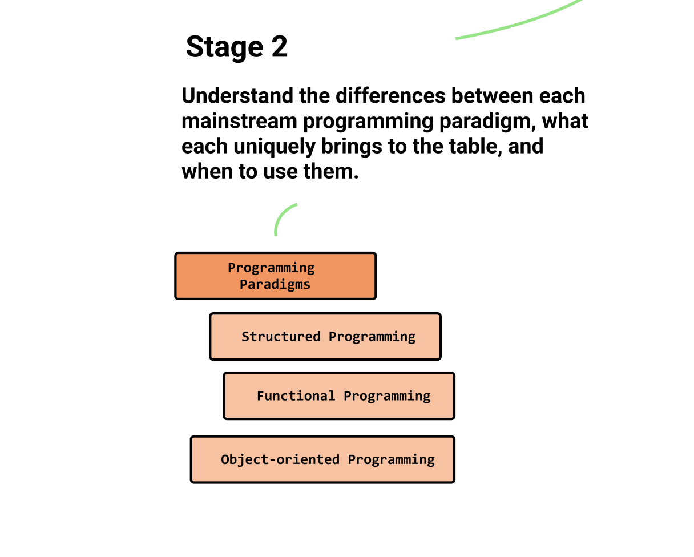
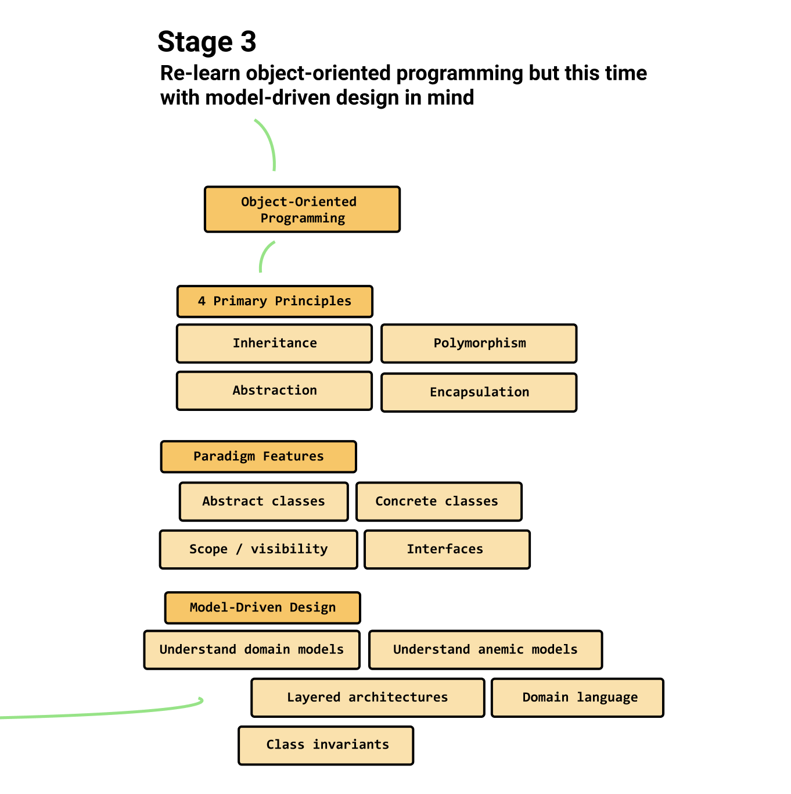
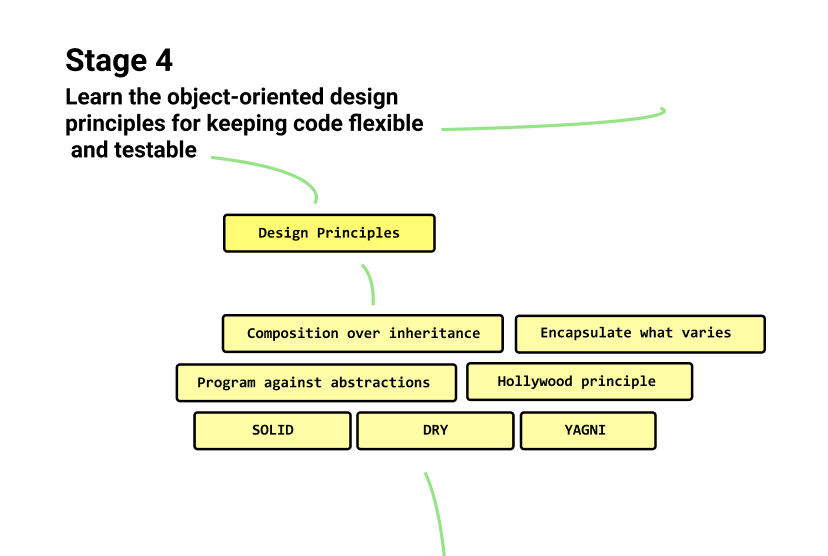
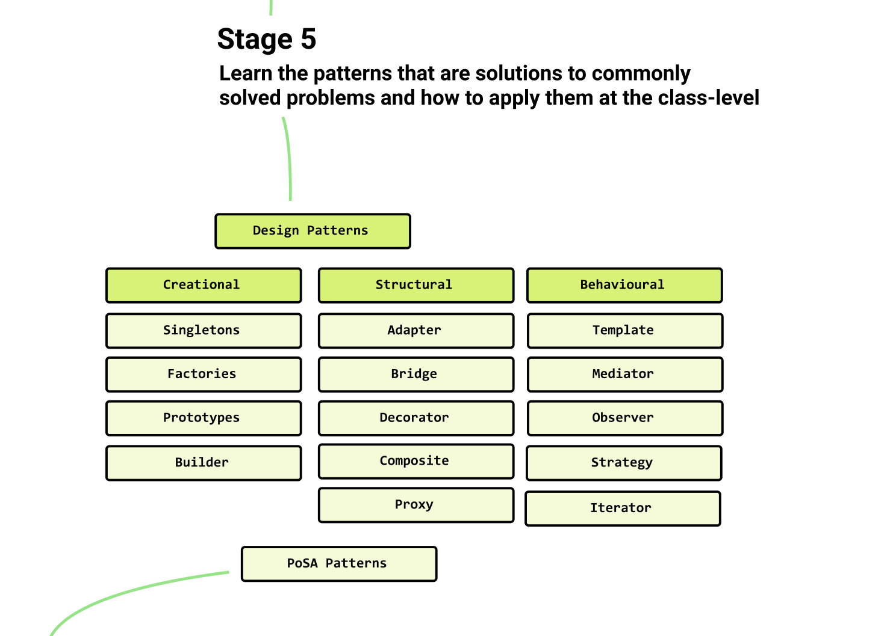
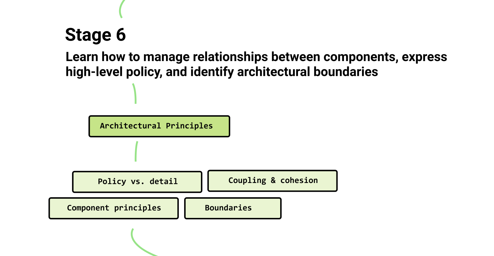

# Levels of design 📝

> Both levels of software design (high and low) are essential. They form a
> symbiotic relationship with each other that when in sync, can lead to
> high-quality software that is easy to maintain and change.

## The **goals of software**

- Goal #1: Satisfy the users' needs while minimizing the effort it takes to do
  so.
- Goal #2: Consistently accomplish Goal #1 as the requirements change.

**Architecture** is about identifying the **system quality attributes** that
will stack our odds of successfully performing Goal #1, and our choice of
**architectural pattern** that will best accommodate the project.

## The Stack 🥞

It depicts the scope of learning from the most intimate details of the
_enterprise pattern_ I've chosen to the way I write _clean_code_.

Each layer of the stack builds on top of the foundation of the previous one.

_In the graphic stack are only examples to some of the most important concepts
at each respective layer. Because the are just too many concepts at each layer._

## The Roadmap 🗺️

More detailed than the stack. The map shows the path that offers this book to
get me ramped up in the world of software design and architecture. 🙌

### Step 1: Clean Code (empathy)

> Human psychology decides what is _good_ and _bad_ design.

Design choices:

- Being consistent
- Preferring meaningful variable, method and class names over writing comments.
- Ensuring code is indented and spaced properly (❤️ Prettier).
- Ensuring all of the tests can run.
- Writing pure functions with no side effects.
- Not passing null.

Author's explanation of clean code consists of:

- My developer mindser (empathy, craftsmanship, growth mindset, design thinking)
- My coding conventions (naming things, refactoring, testing, etc)
- My skills & knowledge (of patterns, principles, and how to avoid code smells
  and anti-patterns)

Learn the _tricks of the trade_ and continue to improve them over time by
improving your knowledge of the essential software development patterns and
principles.

_The tricks of the trade are the quick and clever ways of doing something that
are known by people who regularly do a particular activity_

### Step 2: Programming paradigms

> Understand the differences between each mainstream programming paradigm, what
> each uniquely brings to the table, and when to use them.

From Uncle Bob's book, _Clean Architecture_:

- **Object-Oriented Programming** is the tool best suited for defining how we
  cross architectural boundaries with polymorphism and plugins.
- **Functional programming** is the tool we use to push data to the edges of our
  applications and elegantly handle program flow
- **Structured programming** is the tool we use to compose algorithms

> ...if all you have is a hammer, everything seems like a nail.

The robust software uses a hybrid all 3 programming paradigms styles at
different times.

### Step 3: Object Oriented Programming and Domain-Modeling

> Goal: Re-learn object-oriented programming but this time, with model-driven
> design in mind.

### Step 4: Design Principles

> Goal: Learn the object-oriented design principles for keeping code flexible,
> testable, and maintainable.

### Step 5: Design Patterns

> Goal: Learn the patterns that are solutions to commonly solved problems and
> how to apply them at the class level.

Generic versions of the most commonly occurring problems in software development
have already been categorized and solved. We call these patterns. _Designs
patterns_, actually.

- **Creational patterns** - control how objects are created

  - **Singleton pattern** - ensuring single instance of a class can exist
  - **Abstract Factory pattern** - creating an instance of several families of
    classes
  - **Prototype pattern** - instance cloned from an existing one
  - and others...

- **Structural patterns** - relationships between components

  - **Adapter pattern** - interface to enable classes to work together
  - **Bridge pattern** - splitting a class into a set of classes
  - **Decorator pattern** - dynamically adding responsibilites to objects
  - and others...

- **Behavioral patterns** - communication between objects
  - **Template pattern** - deferring the exact steps of an algorithm to subclass
  - **Mediator pattern** - defining the exact communication channels allowed
    between classes
  - **Observer pattern** - enabling classes to subscribe to something of
    interest and to be notified when a change occurred
  - and others...

#### Design pattern criticisms

Design patterns can add additional complexity to our designs. It's essential to
remember YAGNI and attempt to keep our designs as simple as possible.

### Step 6: Architectural Principles

> Goal: Learn how to manage relationships between components, express high-level
> policy, and identify architectural boundaries.

**Architectural patterns are just design patterns blown-up in scale to the
high-level**, where design patterns are low-level implementations (closer to
classes and functions).
